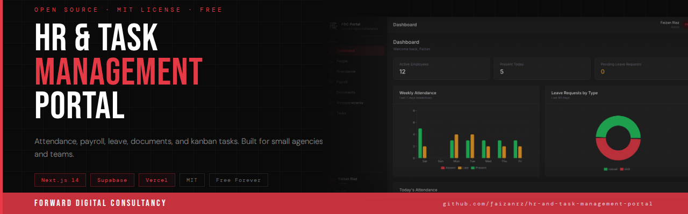

# HR & Task Management Portal

A full-featured employee management portal built with Next.js 14 and Supabase. Consolidates HR, payroll, attendance, task management, and document storage into a single web application.

Originally built for a small agency (~12 staff), but designed to be reusable for any small-to-medium team.

## Features

**People Directory** -- Employee profiles with department, role, contact info, and emergency contacts.

**Attendance & Leave** -- Daily check-in/check-out, automated late detection, leave request workflows with approval system, and leave balance tracking (annual, sick, casual).

**Payroll** -- Monthly salary records, tax deductions, payslip PDF generation, and salary history.

**HR Documents** -- Secure file upload for contracts, IDs, and policies with signed URL access via Supabase Storage.

**Task Management** -- Kanban boards with drag-and-drop columns, task assignment, comments, attachments, and client linking. Built with dnd-kit.

**Announcements** -- Admin-posted pinned notices with expiration dates, displayed on the dashboard.

**Role-Based Access** -- Three roles (admin, manager, staff) with granular permissions across all modules.

## Tech Stack

- **Framework:** Next.js 14 (App Router), React 18, TypeScript
- **Database:** Supabase (PostgreSQL)
- **Auth:** Supabase Auth with role-based access control
- **Storage:** Supabase Storage (private bucket with signed URLs)
- **Email:** Resend (leave approvals, announcements, password resets)
- **Styling:** Tailwind CSS
- **Charts:** Recharts
- **Animations:** Framer Motion
- **Drag & Drop:** dnd-kit

## Getting Started

### Prerequisites

- Node.js 18+
- A Supabase project (free tier works)
- A Resend account (for email notifications)

### 1. Clone the repo

```bash
git clone https://github.com/faizanrz/hr-and-task-management-portal.git
cd hr-and-task-management-portal
```

### 2. Install dependencies

```bash
npm install
```

### 3. Set up environment variables

Copy the example file and fill in your credentials:

```bash
cp .env.local.example .env.local
```

You will need:

- `NEXT_PUBLIC_SUPABASE_URL` and `NEXT_PUBLIC_SUPABASE_ANON_KEY` from your Supabase project dashboard (Settings > API)
- `SUPABASE_SERVICE_ROLE_KEY` from the same page (keep this server-side only)
- `RESEND_API_KEY` from your Resend dashboard
- `NEXT_PUBLIC_APP_URL` set to your deployment URL (or `http://localhost:3000` for local dev)

### 4. Set up the database

Run the SQL schema files in your Supabase SQL editor in order:

1. `supabase/schema/001-phase-1-core.sql` -- core tables (employees, attendance, leave, payroll, HR docs, announcements)
2. `supabase/schema/002-phase-2-tasks.sql` -- task management tables (boards, columns, tasks, comments)
3. `supabase/schema/003-rls-policies.sql` -- row-level security policies

Then create a Supabase Storage bucket named `hr-documents` (set to private).

### 5. Seed your first admin user

Create a user in Supabase Auth (Authentication > Users), then insert a matching row in the `employees` table with `role = 'admin'`.

### 6. Run the dev server

```bash
npm run dev
```

Open [http://localhost:3000](http://localhost:3000) in your browser.

## Project Structure

```
app/
  (auth)/           Login and password reset pages
  (portal)/         Protected routes (dashboard, people, attendance,
                    leave, payroll, documents, tasks, announcements)
  api/              API routes (auth, email, payroll, etc.)
components/ui/      Reusable UI primitives (Button, Badge, Card, Modal, Charts)
lib/                Supabase clients, utilities, constants, employee context
types/              TypeScript interfaces
middleware.ts       Auth guard and route protection
supabase/
  schema/           Database schema SQL files (run these first)
  migrations/       Incremental migration scripts
```

## Deployment

Built for Vercel. Connect your repo and add environment variables in the Vercel dashboard.

```bash
npm run build
```

## License

MIT -- see [LICENSE](LICENSE) for details.
